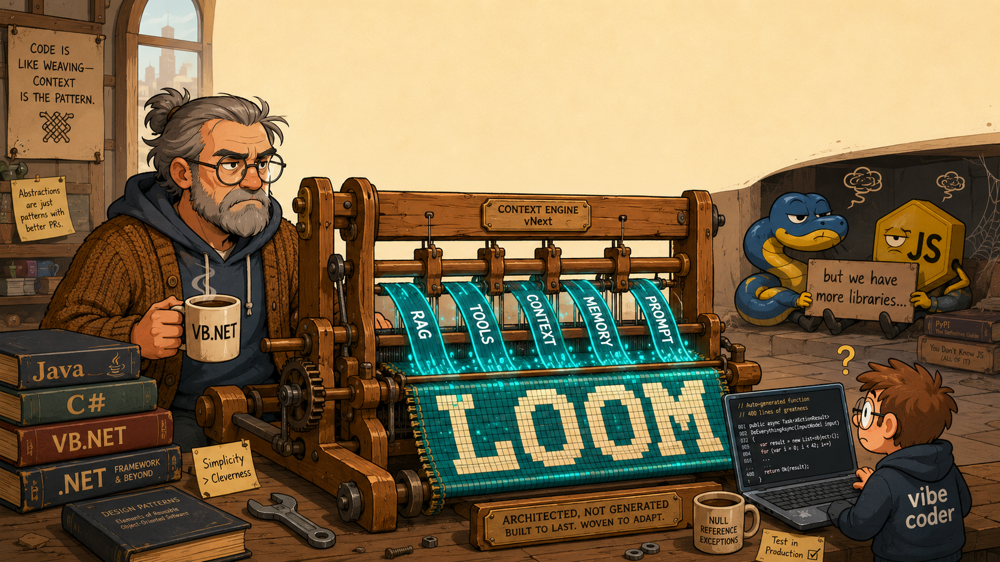

# Loom

> A provider-agnostic framework for **RAG, Tool-calling and Agent orchestration** - built for the languages that the AI hype train forgot to stop at.

> Born because my boss was afraid of, and I quote, "integrating Python into .NET". :skull:

<p align="center">
  
</p>

[](https://opensource.org/licenses/MIT)

---

## 1. What Loom is (and why it exists)

If you want to build an LLM-powered application today, the unwritten rule is simple: open a Python file, `pip install` half of PyPI, and pray that the next breaking change of your favourite framework doesn't land before Friday. The JavaScript/TypeScript world has its own well-stocked shelf too. Everyone else? Welcome to the wasteland.

**Loom is the alternative for the rest of us.**

The goal of the project is to provide a clean, opinionated, **framework-grade abstraction** for RAG, Tooling and Agent workflows in languages that the AI ecosystem has politely ignored - starting with **.NET / VB.NET**, with the explicit ambition of growing into **C#, Java**, and any other "boring enterprise" language that still pays the bills of half the planet.

What Loom gives you out of the box:

- A **single invocation model** (`LlmInvocation`) that holds conversation, RAG, memory, tools, generation options and execution hints in one coherent object.
- A **provider-agnostic engine** (`LoomClient`) that orchestrates validation, routing, tool-calling loops and response assembly.
- **Pluggable provider adapters** (OpenAI Responses API and Google Gemini ship in the box; many more are planned to be added, all possible without touching the engine).
- A **tool registry** with depth control, so your agent can't accidentally enter `while True:` and bankrupt you in a single afternoon.
- **RAG ingestion** with score-based ranking and pluggable injection strategies.
- **Memory modes** ranging from "remember nothing" to "summarise everything", because not every chatbot needs the conversational equivalent of a hoarder's basement.

Loom is not trying to be LangChain. Loom is trying to be **the thing you would have written yourself, if you had three months and a strong opinion about layering.**

> A small note for the **vibe coders** in the audience: yes, this is *VB.NET*. No, it will not auto-generate itself if you stare at it long enough. And yes, those are actual classes with actual responsibilities not 400-line "do everything" scripts.

---

## 2. Architecture & Code Walkthrough

The solution is split into three projects, mirroring the three UML diagrams under [`Loom_documentation/`](Loom_documentation):

```
Loom.sln
├── Loom.Core         -> Pure domain: enums, interfaces, models, validation
├── Loom.Engine       -> Orchestration: client, managers, infrastructure
└── Loom.Providers    -> Concrete adapters: OpenAI, GoogleAI
```

The dependency direction is strict and one-way: **Providers -> Engine -> Core**. Core knows nothing about HTTP, JSON, or who is going to bill your credit card.

### 2.1 Quickstart — implementing a Tool (with a small stroke of genius)

Before walking through every package, here's the shortest possible end-to-end example: **declaring a tool and feeding the agent a RAG context built from Loom's own source code**, so the framework can be tested by asking it questions about itself. The demo is the docs. The docs are the test bench. You only have to write one set of fixtures.

A tool is just a class implementing [`ITool`](Loom.Core/Interfaces/ITool.vb). Two minimal examples — both answering questions *about Loom itself*:

```vbnet
Imports Loom.Core.Interfaces
Imports Loom.Core.Models

' Tool #1 — given a class name, returns which Loom project owns it.
Public Class ClassLocatorTool
    Implements ITool

    Public ReadOnly Property ToolName As String Implements ITool.ToolName
        Get
            Return "class_locator"
        End Get
    End Property

    Public ReadOnly Property Description As String Implements ITool.Description
        Get
            Return "Returns the Loom project (Loom.Core / Loom.Engine / Loom.Providers) that owns a given class name."
        End Get
    End Property

    Public ReadOnly Property Parameters As List(Of ToolParameters) Implements ITool.Parameters
        Get
            Return New List(Of ToolParameters) From {
                New ToolParameters With {
                    .Name = "className",
                    .Type = "string",
                    .Description = "The Loom class to locate, e.g. 'PromptAssembler'"
                }
            }
        End Get
    End Property

    Public ReadOnly Property Required As List(Of String) Implements ITool.Required
        Get
            Return New List(Of String) From {"className"}
        End Get
    End Property

    Public ReadOnly Property Strictness As Boolean? Implements ITool.Strictness
        Get
            Return True
        End Get
    End Property

    Public Function ExecuteAsync(rawInput As Dictionary(Of String, Object)) As Task(Of String) Implements ITool.ExecuteAsync
        Dim name = rawInput("className").ToString()
        ' Replace this with a real lookup against the codebase / index
        Return Task.FromResult("Loom.Engine")
    End Function
End Class

' Tool #2 — given an interface name, returns the file path that defines it.
Public Class InterfaceFinderTool
    Implements ITool

    Public ReadOnly Property ToolName As String Implements ITool.ToolName
        Get
            Return "interface_finder"
        End Get
    End Property

    Public ReadOnly Property Description As String Implements ITool.Description
        Get
            Return "Returns the relative file path where a given Loom interface is defined."
        End Get
    End Property

    Public ReadOnly Property Parameters As List(Of ToolParameters) Implements ITool.Parameters
        Get
            Return New List(Of ToolParameters) From {
                New ToolParameters With {
                    .Name = "interfaceName",
                    .Type = "string",
                    .Description = "Interface name, e.g. 'IProviderAdapter'"
                }
            }
        End Get
    End Property

    Public ReadOnly Property Required As List(Of String) Implements ITool.Required
        Get
            Return New List(Of String) From {"interfaceName"}
        End Get
    End Property

    Public ReadOnly Property Strictness As Boolean? Implements ITool.Strictness
        Get
            Return True
        End Get
    End Property

    Public Function ExecuteAsync(rawInput As Dictionary(Of String, Object)) As Task(Of String) Implements ITool.ExecuteAsync
        Dim name = rawInput("interfaceName").ToString()
        ' Replace this with a real lookup against the codebase / index
        Return Task.FromResult("Loom.Core/Interfaces/IProviderAdapter.vb")
    End Function
End Class
```

Wiring these into a `LoomClient` is then a five-line affair:

```vbnet
Dim client As New LoomClient()
client.RegisterProvider(New OpenAIAdapter(apiKey, New PromptAssembler()))
client.Tool.RegisterTool(New ClassLocatorTool())
client.Tool.RegisterTool(New InterfaceFinderTool())

client.Conversation.AddUserRequest("Which project owns PromptAssembler, and where is IProviderAdapter declared?")
Dim response = Await client.SendAsync()
```

Yes, the idea is to ask Loom something about Loom. As soon as someone has a hassle to chunk the code it will be added as a "testing dataset".

### 2.2 `Loom.Core` — the contract layer

UML reference: [`Loom_documentation/Core.txt`](Loom_documentation/Core.txt)

This project defines the *shape* of every concept Loom manipulates. Nothing here knows how to talk to a model - it only knows what a conversation, a tool, a chunk and a validation result *look like*.

**Enums** ([Loom.Core/Enums](Loom.Core/Enums)) — the four canonical knobs of the framework:

- `MessageRole` — `System | User | Assistant | Tool`.
- `MemoryMode` — `None | FullHistory | Summary | Extractive | Hybrid`.
- `InjectionStrategy` — how RAG context is woven into the prompt (`Sectioned`, `SystemXML`, `SystemJSON`).
- `ExecutionPriority` — `Balanced | LatencyOptimized | CostOptimized | QualityOptimized`, used by the router when no explicit model is requested.

**Interfaces** ([Loom.Core/Interfaces](Loom.Core/Interfaces)) — the four contracts that keep the architecture honest:

- [`ILlmInvocation`](Loom.Core/Interfaces/ILlmInvocation.vb) — the master object, exposing `Conversation`, `Rag`, `Memory`, `Tools`, `Options`, `Hints` and a `Validate()` method.
- [`IProviderAdapter`](Loom.Core/Interfaces/IProviderAdapter.vb) — what every provider must implement: a `ProviderName`, an `ExecuteAsync(invocation)` and a `SupportsCapability(name)`.
- [`ITool`](Loom.Core/Interfaces/ITool.vb) — the contract for any function the model can call. A name, a description, a parameter schema, a `Required` list, optional strictness, and an `ExecuteAsync(rawInput)`.
- [`IAssembler`](Loom.Core/Interfaces/IAssembler.vb) — abstracts how raw invocations are turned into the typed message list that adapters consume.
- [`IValidationResult`](Loom.Core/Interfaces/IValidationResult.vb) — the boring-but-essential success/error pair.

**Models** ([Loom.Core/Models](Loom.Core/Models)) — the concrete data carriers. Highlights:

- [`LlmInvocation`](Loom.Core/Models/LlmInvocation.vb) — the single source of truth, implementing `ILlmInvocation` and delegating its `Validate()` to `InvocationValidator`.
- [`ConversationState`](Loom.Core/Models/ConversationState.vb) — `TraceId`, `SystemPrompt`, optional `TokenBudget`, the message buffer and a `TurnIndex`.
- [`Message`](Loom.Core/Models/Message.vb) — role, content, and the tool-call fields (`ToolCallId`, `ToolName`, `ToolArgs`) needed to reconstruct multi-turn function calling.
- [`RagContext`](Loom.Core/Models/RagContext.vb) + [`RagChunk`](Loom.Core/Models/RagChunk.vb) — the retrieval payload, with per-chunk scores and a `MaxTokens` budget.
- [`ToolContext`](Loom.Core/Models/ToolContext.vb), [`ToolDefinition`](Loom.Core/Models/ToolDefinition.vb), [`ToolParameters`](Loom.Core/Models/ToolParameters.vb), [`ToolCallInvocation`](Loom.Core/Models/ToolCallInvocation.vb) — everything needed to declare a tool, expose it to the model, and parse the model's reply.
- [`LlmResponse`](Loom.Core/Models/LlmResponse.vb) — the normalised return type: id, model used, role, content, tool calls and token usage. Every provider adapter must converge here.
- [`ValidationResult`](Loom.Core/Models/ValidationResult.vb) — implements `IValidationResult` with the conventional `Success()` / `Failure(errors)` factory pair.

**Validation** ([`InvocationValidator`](Loom.Core/InvocationValidator.vb)) — runs the four sanity checks every developer forgets at least once:

1. The conversation is not empty.
2. The RAG budget is strictly smaller than the total token budget.
3. Every registered tool has a parameter schema.
4. A system prompt (or system message) actually exists.

If anything fails, you get a `ValidationResult.Failure(errors)`. If everything passes, the engine proceeds. There is no silent shrug.

### 2.3 `Loom.Engine` — the orchestrator

UML reference: [`Loom_documentation/Engine.txt`](Loom_documentation/Engine.txt)

This is the brain. It composes Core models into actual behaviour.

**Assemblers** — [`PromptAssembler`](Loom.Engine/Assemblers/PromptAssembler.vb) implements `IAssembler` and is responsible for:

- `Assemble(invocation)` — copies the raw message list, finds (or creates) the system message and injects the context block produced by `BuildContextBlock`.
- `AssembleInputItems(invocation)` — produces a provider-neutral `List(Of AssembledItem)`. Tool messages are split into the canonical pair `function_call` + `function_call_output` so adapters don't have to re-derive the structure.
- `BuildContextBlock(invocation)` — currently emits a `### LONG-TERM MEMORY ###` and a `### CONTEXT ###` section. The `InjectionStrategy` enum is wired up to allow XML/JSON variants in future iterations.
- `AddContent(original, context)` — concatenation with a sane separator. That's it. No need to make it complicated.

**Context managers** ([Loom.Engine/Context](Loom.Engine/Context)) — one per concern, each holding a reference to the same `LlmInvocation`:

- [`ConversationManager`](Loom.Engine/Context/ConversationManager.vb) — `AddMessage`, `AddUserRequest`, `AddToolResult`, `ResetHistory(keepSystemMessage)`. Increments `TurnIndex` on every message.
- [`RagManager`](Loom.Engine/Context/RagManager.vb) — `AddResults(chunks, clearExisting)` filters empty chunks and sorts by descending score; `SetStrategy` and `HasContext` round it out.
- [`MemoryManager`](Loom.Engine/Context/MemoryManager.vb) — `UpdateMemory(newData)` dispatches on `MemoryMode`. `None` and `FullHistory` and `Summary` are wired; `Extractive` and `Hybrid` deliberately throw `NotImplementedException` (see Section 3).
- [`ToolRegistry`](Loom.Engine/Context/ToolRegistry.vb) — `RegisterTool(ITool)` indexes the tool by name, builds its `ToolDefinition`, and pushes it into the invocation. `ExecuteAsync(name, args)` dispatches and returns a string — including a structured error string if the tool is missing or throws, so the model can recover instead of the process crashing.

**Infrastructure** ([Loom.Engine/Infrastructure](Loom.Engine/Infrastructure)):

- [`TokenCounter`](Loom.Engine/Infrastructure/TokenCounter.vb) — heuristic `length / 4` count, summed over messages, RAG chunks and memory. Yes, it's an approximation. Yes, it should eventually be a real tokenizer. No, it won't accidentally let your context double its budget today.
- [`ModelCatalog`](Loom.Engine/Infrastructure/ModelCatalog.vb) — the in-memory list of known models with `ProviderName`, `ContextWindow`, `CostLevel`. Provides `GetModelInfo(modelId)` and `GetFallBack(priority)`.
- [`ExecutionRouter`](Loom.Engine/Infrastructure/ExecutionRouter.vb) — `RegisterAdapter(adapter)` keeps the list unique by provider name; `Route(invocation)` resolves the preferred model (or asks the catalog for a fallback by priority) and returns the matching adapter, raising if no provider is installed for it.
- [`ProviderHttpClient`](Loom.Engine/Infrastructure/ProviderHttpClient.vb) — a single shared `HttpClient` with `NullValueHandling.Ignore` JSON serialisation, used by every adapter.

**The client** — [`LoomClient`](Loom.Engine/LoomClient.vb) is the public entry point:

```vbnet
Public Async Function SendAsync() As Task(Of LlmResponse)
    ' 1. Formal validation
    ' 2. Token budget check
    ' 3. Route to a provider adapter
    ' 4. Loop up to MaxToolDepth:
    '       - Execute adapter
    '       - Append assistant content (if any)
    '       - If no tool calls -> return
    '       - Otherwise execute every tool and append the results
    ' 5. Final adapter call after the tool loop
End Function
```

That loop is the whole "agent" pattern — no decorators, no callbacks-in-callbacks, no DSL. Just a `While`. If it really holds up, I'll buy everyone a drink.

### 2.4 `Loom.Providers` — the adapters

UML reference: [`Loom_documentation/Providers.txt`](Loom_documentation/Providers.txt)

Each adapter implements `IProviderAdapter` and is responsible for translating the neutral invocation into the provider's native dialect.

- [`OpenAI/OpenAIAdapter`](Loom.Providers/OpenAI/OpenAIAdapter.vb) — talks to `https://api.openai.com/v1/responses`. Uses [`OpenAIToolSchemaBuilder`](Loom.Providers/OpenAI/OpenAIToolSchemaBuilder.vb) to convert `ToolDefinition` into [`ProviderToolSchema`](Loom.Providers/Core/ProviderToolSchema.vb), maps assembled items into the `function_call` / `function_call_output` shape OpenAI expects, parses [`ModelResponse`](Loom.Providers/OpenAI/ModelResponse.vb) back into a normalised `LlmResponse`.
- [`GoogleAI/GoogleAIAdapter`](Loom.Providers/GoogleAI/GoogleAIAdapter.vb) — talks to `generativelanguage.googleapis.com/v1beta`. Translates the same neutral input into Gemini's `contents` / `system_instruction` / `function_declarations` layout, deserialising the reply into [`GenerateContentResponse`](Loom.Providers/GoogleAI/GenerateContentResponse.vb) before normalising.

Both adapters converge on the same `LlmResponse` so the `LoomClient` loop never has to know which provider it just spoke to.

### 2.5 The data flow in one paragraph

A caller builds an `LlmInvocation`, registers one or more `ITool`s and at least one `IProviderAdapter` on a `LoomClient`. On `SendAsync()`, the client validates the invocation, checks the token budget, asks the `ExecutionRouter` for a provider, and enters the tool-call loop. The chosen adapter delegates message preparation to the `PromptAssembler`, calls the provider over `ProviderHttpClient`, and returns a normalised `LlmResponse`. If the response contains tool calls, the `ToolRegistry` executes each tool, the `ConversationManager` records the results, and the loop continues until the model produces a tool-free reply or `MaxToolDepth` is reached. That's the whole story.

---

## 3. Contributing

Contributions are not just welcome — they are the reason this project exists. The "ignored language" list is long, and Loom's job is to shrink it.

Before opening a PR, please respect the workflow below. It exists so that the codebase doesn't turn into a zoo, and so that the next contributor can still understand what is going on.

### Step 1 — State the problem

Open an issue describing **what you want to solve or build**. One of three flavours is expected:

1. **A bug or a concrete pain point** in the current codebase. Include a minimal reproduction.
2. **A feature** that fits within the existing scope (a new memory mode, a new injection strategy, a new tool, a smarter router…). Explain *why* it belongs in Loom and not in user code.
3. **A new development direction** — for example, a **C# port**, a **Java port**, or any other language Loom should grow into. (The .NET / VB.NET house is taken; pick another wing.) Explain the target ecosystem, the language idioms you want to respect, and how the public API will map to the existing concepts.

If you can't write the problem statement in two paragraphs, the problem isn't ready yet.

### Step 2 — Update the UML *first*

The diagrams under [`Loom_documentation/`](Loom_documentation) are not decoration. They are the **source of truth** for the architecture, and every structural change must be reflected there.

- Adding a class? Add it to the matching diagram (`Core.txt`, `Engine.txt`, `Providers.txt`) — and to the consolidated [`z_Loom.txt`](Loom_documentation/z_Loom.txt).
- Adding a method or a public property? Update the class block.
- Changing a relationship (implements, depends on,...)? Update the arrows.
- Adding a brand-new module (a new package, a new provider, a new language target)? Add a new PlantUML file and link it from the consolidated diagram.

A pull request that changes the code without updating the UML will be sent back. A pull request that updates the UML without touching the code is fine — sometimes design has to come first.

### Step 3 — Implement, respecting the layering rules

- `Loom.Core` depends on nothing but the .NET base class library. Do not import HTTP, JSON or any provider-specific type into Core.
- `Loom.Engine` depends on `Loom.Core`. Orchestration logic goes here.
- `Loom.Providers` depends on `Loom.Engine` and `Loom.Core`. Provider-specific code goes here and **only** here.
- New ports (C#, Java, …) must mirror this same three-layer split. If your target language calls them differently, that's fine — but the boundary must be respected.

### Step 4 — Open the PR

Include in the description:

- A link to the originating issue.
- A short summary of the change.
- The updated UML files in the same PR (no follow-ups, no "I'll do it later").
- A note for any `NotImplementedException` you intentionally left behind, with a justification.

### A word for our **vibe-coding** friends

You are welcome here. Truly. But please:

- **Read the UML before writing the code.** It will save both of us a review round.
- **Do not paste 800 lines of generated code** into a PR with the message *"works on my machine"*. We can tell. Everyone can tell.
- **If you don't know what a class does, ask** — don't add a sibling class "just in case". Loom has a small surface on purpose; let's keep it that way.
- A model can write the code. It cannot write the *reason*. The reason is your job, and it's the part that actually matters.

Welcome to Loom. Now go open an issue.

